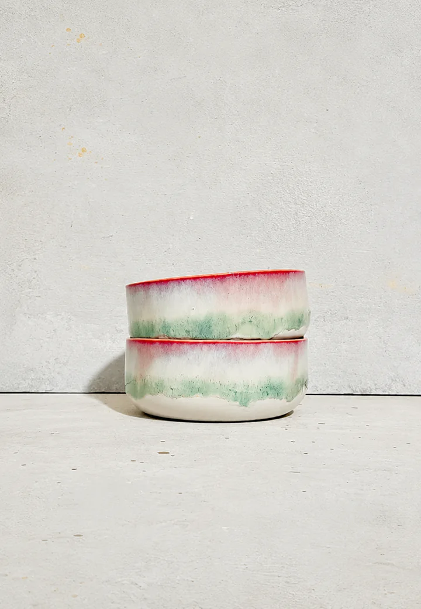
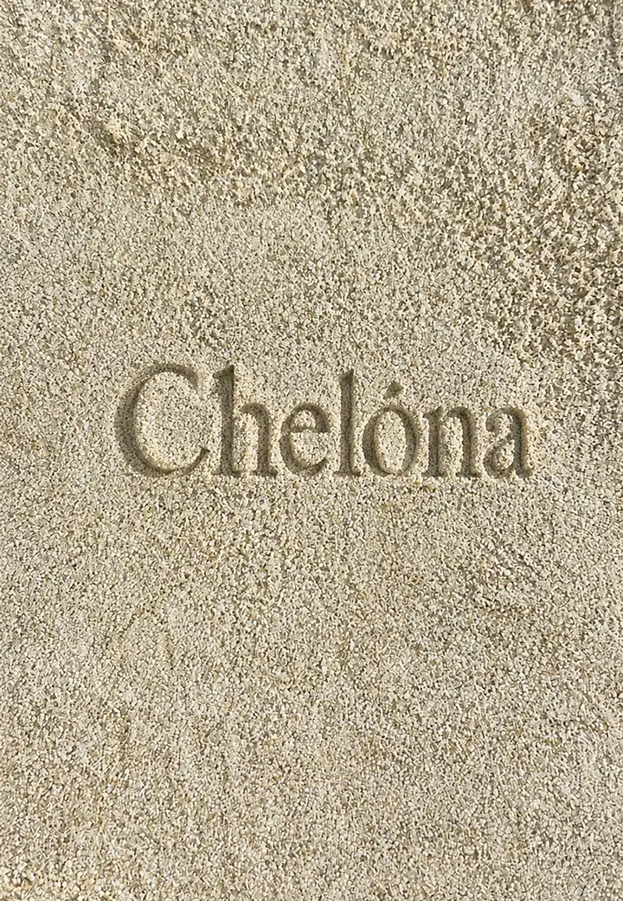
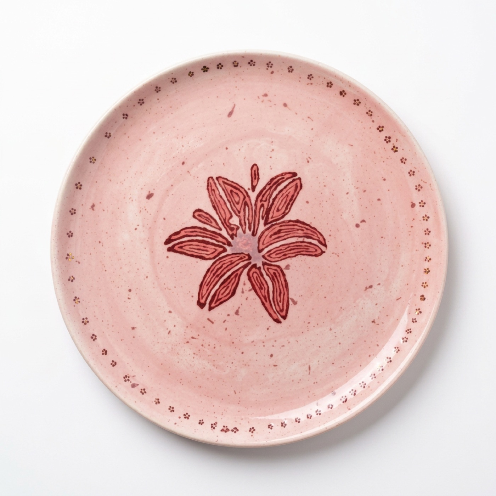
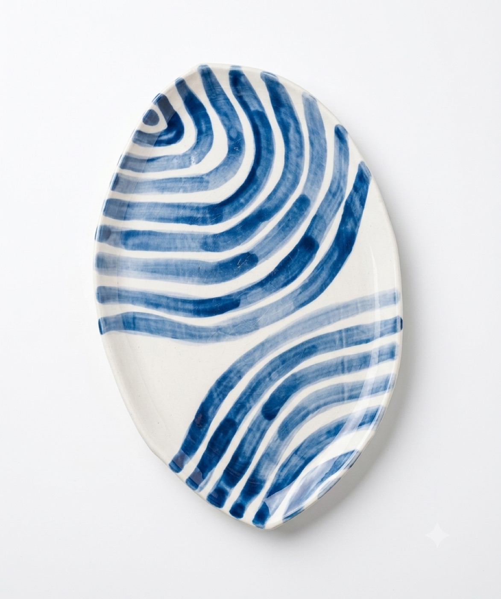
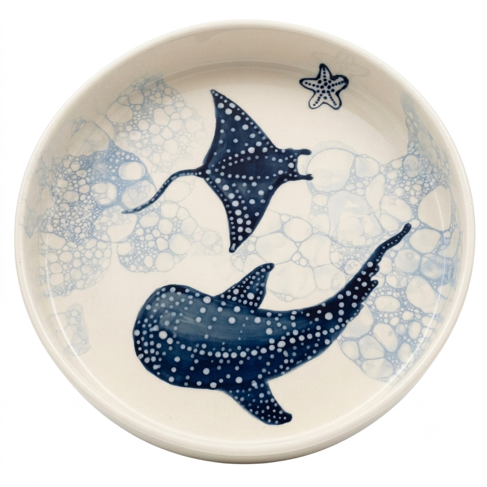
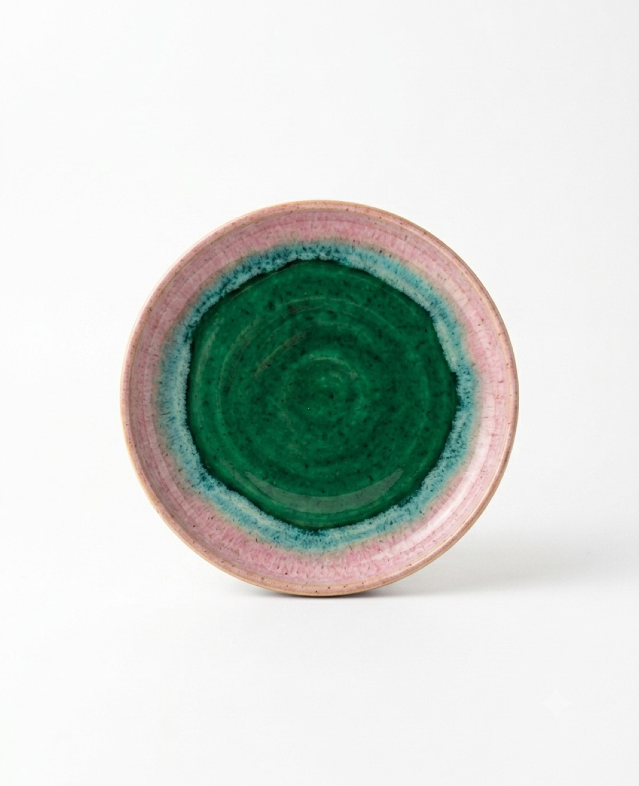

# CHELÓNA

*Handcrafted ceramics, presented with the quiet confidence of a luxury atelier.*

 

<table>
<tr>
<td width="50%"></td>
<td width="50%"></td>
</tr>
</table>

 

## Overview

CHELÓNA is a concept e-commerce experience for an imagined ceramics atelier — designed and built end‑to‑end as a front‑end showcase. Rather than defaulting to a conventional storefront layout, the project treats each piece of tableware as an object worth pausing on: generous whitespace, restrained typography, and a warm, sand‑and‑clay palette carry the same editorial tone from the homepage through to every product page.

The goal was to demonstrate how a small, design‑led brand could present its craft online — with the visual discipline of an editorial site and the structure of a real product catalogue underneath it.

## Experience

The homepage opens on a full‑bleed, two‑image hero — the same pairing shown above — before unfolding into a sequence of deliberately paced sections: the collection grid, a three‑panel Price / Instagram / Workshop band, an alternating narrative on material, craft and community, and a closing statement piece. Navigating into a product mirrors the calm of the rest of the site: the selected card expands into its own page using the browser's native View Transitions API, so the image and title carry across the navigation instead of the page simply reloading.

Motion throughout is deliberate rather than decorative — content reveals gently as it enters the viewport, the header responds subtly to scroll, and returning to the collection restores you to exactly where you left off.

## Key Highlights

- **Shared‑element page transitions** — product cards morph seamlessly into their dedicated page via the View Transitions API, with a clean, instant fallback in browsers that don't yet support it
- **Scroll‑restoring navigation** — leaving a product page and returning to the collection lands you back at your exact scroll position, not the top of the page
- **A genuine design system** — a shared palette, spacing scale, and easing curve are defined once as CSS custom properties, with each product carrying its own accent colour
- **Scroll‑driven reveals** — sections and imagery ease into view as they're scrolled into frame
- **Search‑ and share‑ready markup** — every page carries its own metadata, Open Graph and Twitter card data, and JSON‑LD structured data describing the organisation, the collection, and each individual product
- **Considered image delivery** — WebP throughout, lazy‑loaded below the fold, with above‑the‑fold imagery preloaded for a fast first paint

## The Collection

Nine designs make up the CHELÓNA range — dinner and soup plates, serving pieces, a hand‑thrown matcha bowl, and a mug‑and‑saucer set — each hand‑painted with its own motif, from tidal stripes to a hand‑drawn lily. Every piece has its own dedicated page: full‑size photography, a short piece of writing on its material and story, its price, and a curated set of related pieces from the rest of the collection.

<table>
<tr>
<td width="25%"></td>
<td width="25%"></td>
<td width="25%"></td>
<td width="25%"></td>
</tr>
</table>

## Responsive Design

The layout was built to hold its composure at every size, not just scale down. Typography and spacing flow fluidly between breakpoints using CSS `clamp()`, and each major section — the hero, the collection grid, the storytelling rows, the footer — has its own tailored arrangement across nine breakpoints spanning small phones through to large desktop displays.

## Technology

- **HTML5** — semantic structure with JSON‑LD structured data
- **CSS3** — custom properties, Grid & Flexbox, fluid type and spacing, the View Transitions API
- **JavaScript** — vanilla, dependency‑free

No framework, template engine, or build tooling sits behind the site — every page is hand‑authored.

## Project Type

CHELÓNA is a fictional brand, created as a self‑directed concept project for portfolio purposes. The studio, its products, and its story are part of the design exercise and do not represent a real business.

