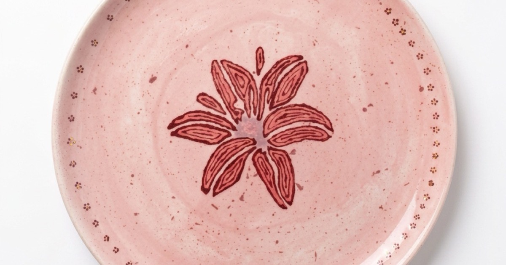

# CHELÓNA

A concept website for a luxury handcrafted ceramics studio — designed and built as a front-end portfolio piece.

## Overview

CHELÓNA presents an imagined ceramics atelier and its nine-piece tableware collection through an editorial, gallery-like experience. The site pairs a quiet, premium visual language with considered motion and typography, focusing on how a small artisan brand would present its craft, its story, and its products online.

This is a self-directed concept project, not a commissioned client build.

## Preview

## Highlights

- **Nine dedicated product pages** — each piece has its own page with imagery, story copy, pricing, and related-product suggestions
- **Shared-element page transitions** — product cards morph into their product page using the native View Transitions API, with a clean fallback where it isn't supported
- **Scroll-driven reveals** — content sections animate into view on scroll via `IntersectionObserver`
- **Persisted scroll position** — returning from a product page to the homepage restores the exact scroll position in the product grid
- **Structured, SEO-ready markup** — per-page metadata, Open Graph and Twitter cards, and JSON-LD structured data for the organization, product listings, and individual products
- **A cohesive design system** — CSS custom properties define a shared palette, spacing, and easing scale, with a distinct accent color per product
- **Performance-conscious imagery** — WebP assets, lazy loading, and preloaded above-the-fold images to keep the experience fast

## Built With

- HTML5 with semantic markup and JSON-LD structured data
- CSS3 — custom properties, Grid & Flexbox, fluid type and spacing via `clamp()`, the View Transitions API
- Vanilla JavaScript — no frameworks or dependencies

## Responsive Design

The layout is fully responsive, with tailored breakpoints from small mobile devices through to large desktop screens rather than a single scaled-down layout.

## About This Project

CHELÓNA is a fictional brand created for portfolio purposes. All product names, imagery, pricing, and studio details are part of the concept and do not represent a real business.
